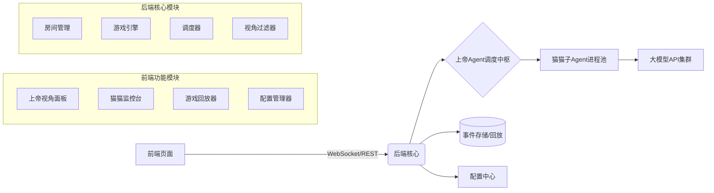
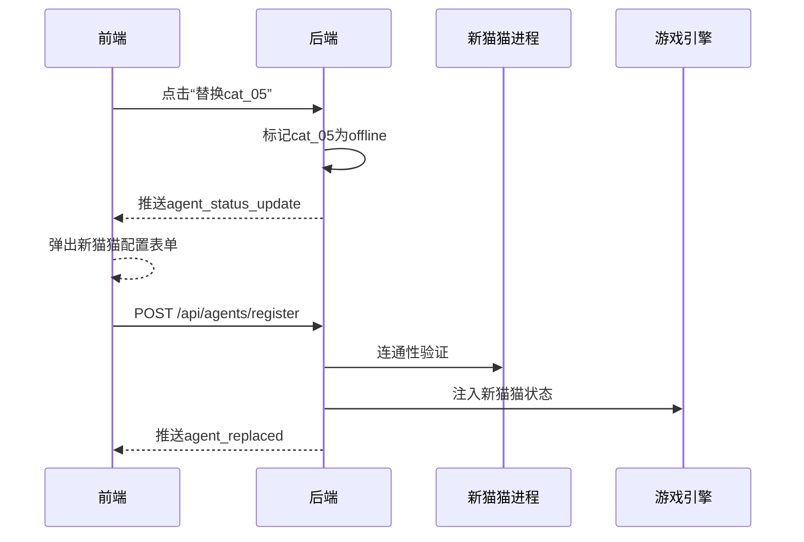

# 狼人杀AI猫猫系统：前后端集成设计说明书

> 主题：上帝视角监控 + 猫猫进程调度 + 实时游戏可视化

## 一、整体架构



---

## 二、通信协议规范

### 2.1 双通道通信设计

| 通道 | 协议 | 用途 | 频率 | 安全要求 |
|---|---|---|---|---|
| 控制通道 | REST API (HTTPS) | 房间管理 / 配置 / 猫猫注册 | 低频 | JWT认证 |
| 游戏通道 | WebSocket (WSS) | 实时游戏事件 / 状态同步 | 高频 | 房间Token校验 |

### 2.2 REST API 核心端点

#### 房间管理

```http
POST /api/rooms
Body: {
  "player_count": 8,
  "config_preset": "standard_8",
  "cat_agents": ["cat_01", "cat_02", "..."]
}
Resp: {
  "room_id": "room_8p_001",
  "ws_url": "wss://<host>/api/ws/room_8p_001"
}
```

- `GET /api/rooms/{room_id}/config`：获取本局角色配置预览
- `POST /api/rooms/{room_id}/start`：房主启动游戏（需所有猫猫注册完成）

#### 猫猫管理（上帝Agent专用）

```http
POST /api/agents/register
Body: {
  "player_id": "cat_03",
  "endpoint": "http://localhost:8003/act",
  "model": "qwen-max"
}
Resp: {
  "status": "registered",
  "timeout": 15
}
```

- `GET /api/agents/status?room_id=room_8p_001`：返回所有猫猫健康状态

> 当前后端实现状态：以上端点均已落地，且支持动态人数（8~12）与房间级配置回显。

### 2.3 WebSocket 事件协议

#### 前端订阅

```json
{
  "type": "subscribe",
  "room_id": "room_8p_001",
  "view_mode": "god"
}
```

- `view_mode` 可选：
  - `god`：上帝视角
  - `player:cat_03`：模拟某猫猫视角

#### 视角切换

```json
{
  "type": "change_view",
  "mode": "player:cat_03"
}
```

切换成功后服务端返回 `view_changed`，随后推送新的 `room_state`（按新视角过滤）。

#### 后端推送示例

```json
{
  "event": "phase_changed",
  "data": {
    "phase": "night_werewolf",
    "remaining_time": 60,
    "active_players": ["cat_01", "cat_04"],
    "god_view": {
      "wolf_targets": {"cat_01": "cat_05", "cat_04": "cat_05"},
      "consensus_target": "cat_05"
    }
  }
}
```

```json
{
  "event": "agent_speech",
  "data": {
    "player_id": "cat_02",
    "role": "seer",
    "content": "我怀疑cat_07是狼，发言逻辑矛盾",
    "timestamp": 1707890123,
    "latency_ms": 1240,
    "is_fallback": false
  }
}
```

```json
{
  "event": "agent_status_update",
  "data": {
    "player_id": "cat_05",
    "status": "timeout",
    "last_heartbeat": "2024-02-14T10:23:45Z",
    "error_msg": "HTTP 503: Model API overloaded"
  }
}
```

---

## 三、前端功能模块与数据流

### 3.1 上帝视角监控面板

| 区域 | 后端数据来源 | 更新频率 | 交互能力 |
|---|---|---|---|
| 全局状态栏 | `room_state` 事件 | 实时 | 暂停 / 加速游戏 |
| 猫猫健康矩阵 | `agent_status_update` | 每5秒心跳 | 手动重连 / 替换猫猫 |
| 阶段行动日志 | `phase_changed` + `agent_action` | 事件驱动 | 查看原始请求/响应 |
| 发言时间轴 | `agent_speech` | 实时 | 筛选角色 / 玩家 |
| 配置快照 | `GET /rooms/{id}/config` | 开局时 | 导出配置 |

### 3.2 猫猫进程管理台（运维关键流程）



### 3.3 游戏回放器

- 数据源：游戏结束后生成 `replay_package.json`（完整事件流 + 猫猫原始响应）
- 能力：
  - 时间轴拖拽
  - 视角切换（上帝 / 任意猫猫）
  - 展示猫猫决策依据（发送给猫猫的 `visible_state`）
  - 导出 Markdown 复盘报告

---

## 四、关键数据结构

### 4.1 房间状态快照

```ts
interface RoomSnapshot {
  room_id: string;
  status: "waiting" | "running" | "ended";
  player_count: number;
  role_distribution: Record<string, number>;
  players: Array<PlayerInfo>;
  current_phase: GamePhase;
  phase_end_time?: number;
  speech_history: SpeechEntry[];
}
```

### 4.2 猫猫注册配置

```json
{
  "player_id": "cat_07",
  "endpoint": "http://cat-agent-07:8000/act",
  "model_config": {
    "provider": "dashscope",
    "model": "qwen-max",
    "temperature": 0.7,
    "max_tokens": 150
  },
  "timeout_sec": 15,
  "fallback_strategy": "random_vote"
}
```

---

## 五、安全与体验保障

| 场景 | 解决方案 |
|---|---|
| 前端误操作 | 关键操作二次确认 + 审计日志 |
| 敏感信息泄露 | `view_mode` 严格校验；玩家视角剥离 `role/god_view` |
| 猫猫进程泄露 | endpoint 仅上帝视角且管理员模式可见 |
| 断线重连 | 前端维护 `last_event_id`，重连走增量事件流 |
| 调试支持 | `debug_mode` 开启时推送脱敏后的原始请求/响应 |

---

## 六、前端集成示例

```ts
const ws = new WebSocket(`wss://backend/api/ws?token=${roomToken}`);

ws.onmessage = (event) => {
  const msg = JSON.parse(event.data);

  switch (msg.event) {
    case "phase_changed":
      updatePhasePanel(msg.data);
      if (msg.data.god_view) {
        showGodInsights(msg.data.god_view);
      }
      break;

    case "agent_speech":
      addSpeechBubble({
        ...msg.data,
        isCurrentView:
          viewMode === "god" ||
          (viewMode.startsWith("player:") && viewMode.endsWith(msg.data.player_id)),
      });
      break;

    case "agent_status_update":
      updateAgentHealthGrid(msg.data);
      if (msg.data.status === "error") {
        showAlert(`🐱 ${msg.data.player_id} 异常!`);
      }
      break;
  }
};

function switchViewMode(mode: string) {
  ws.send(JSON.stringify({ type: "change_view", mode }));
}
```

---

## 七、交付清单

### 后端
- 完整 REST API 文档（OpenAPI 3.0）
- WebSocket 事件字典（字段说明 / 触发条件）
- 前端 SDK 示例（TypeScript Axios + WebSocket封装）

### 前端
- 事件处理参考实现（React/Vue组件示例）
- 猫猫注册表单模板（含配置校验）
- 上帝视角面板UI组件库（Figma 设计稿链接）

### 运维
- 健康检查端点：`GET /health`（含猫猫进程存活状态）
- 压测脚本：模拟12猫猫并发游戏
- 部署 Checklist：含“前端连接后端”验证步骤

---

## 核心原则

- 前端是上帝的眼睛，后端是上帝的手
- 前端只负责展示与操作指令下发，所有规则与状态变更由后端上帝Agent裁定
- 通过 `view_mode` 实现视角隔离，前端不能越权获取敏感信息
- 所有猫猫进程管理操作必须留痕，保证可审计性
